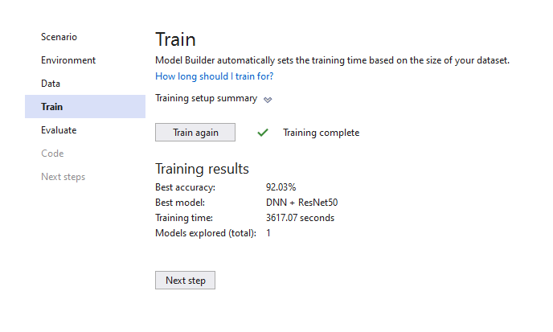

# ImageClassificationExample
An example about Image Classification

## 17 Flower Category Database

[http://www.robots.ox.ac.uk/~vgg/data/flowers/17/](http://www.robots.ox.ac.uk/~vgg/data/flowers/17/)

This set contains images of flowers belonging to 17 different categories. 
The images were acquired by searching the web and taking pictures. There are
80 images for each category. 

The database was used in:

Nilsback, M-E. and Zisserman, A.  A Visual Vocabulary for Flower Classification.
Proceedings of the IEEE Conference on Computer Vision and Pattern Recognition (2006) 
[http://www.robots.ox.ac.uk/~vgg/publications/papers/nilsback06.{pdf,ps.gz}](http://www.robots.ox.ac.uk/~vgg/publications/papers/nilsback06.{pdf,ps.gz}).

| ML.NET version | API type          | Status                        | App Type    | Data type | Scenario            | ML Task                   | Algorithms                  |
|----------------|-------------------|-------------------------------|-------------|-----------|---------------------|---------------------------|-----------------------------|
| Microsoft.ML 1.5.0 | Dynamic API | Up-to-date | Console apps | Image files | Image classification | Image classification with TensorFlow model retrain based on transfer learning  | DNN architectures: ResNet, InceptionV3, MobileNet, etc.  |

## Experiment Results

|                                                     Summary                                                    |
|----------------------------------------------------------------------------------------------------------------|
|ML Task: image-classification                                                                                   |
|Dataset: C:\Users\La Quoc Thang\AppData\Local\Temp\72cb20ad-b7c0-4bd0-9f08-d7b5ec2520b1.tsv                     |
|Label : Label                                                                                                   |
|Total experiment time : 3617.0667002 Secs                                                                       |
|Total number of models explored: 1                                                                              |

## Top 1 models explored

| # | Trainer | MicroAccuracy | MacroAccuracy | Duration | #Iteration |
| --- | --- | --- | --- | --- | --- |
|1 | ImageClassification | 0.9203 | 0.9233 | 3617.1 | 1 |

